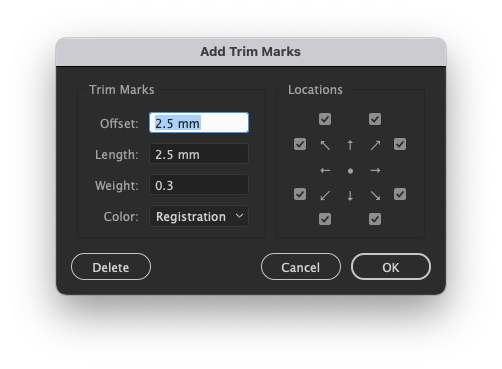

Illustrator Scripts
===================

Known Issue
-----------

* Relink - In document with large number of artboards scattered through multiple row positions, only first row of selection is detected.
* Impose - When artboards exceed canvas size, units will break causing oversized `PlacedItem`.

Resources
---------

[Official](https://www.adobe.com/devnet/illustrator/scripting.html):
* [CC 2017 Scripting Guide](https://www.adobe.com/content/dam/acom/en/devnet/illustrator/pdf/AI_ScriptGd_2017.pdf)
* [CC 2017 JavaScript Reference](https://www.adobe.com/content/dam/acom/en/devnet/illustrator/pdf/Illustrator_JavaScript_Scripting_Reference_2017.pdf)

Unofficial:
* [Scripting Guide](https://ai-scripting.docsforadobe.dev/)
* [CS6 JavaScript Reference](http://jongware.mit.edu/iljscs6html/iljscs6/inxx.html)