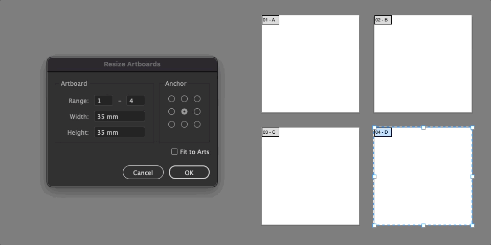
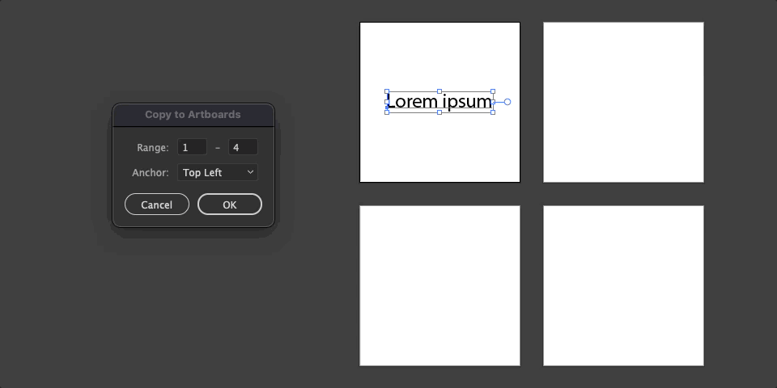
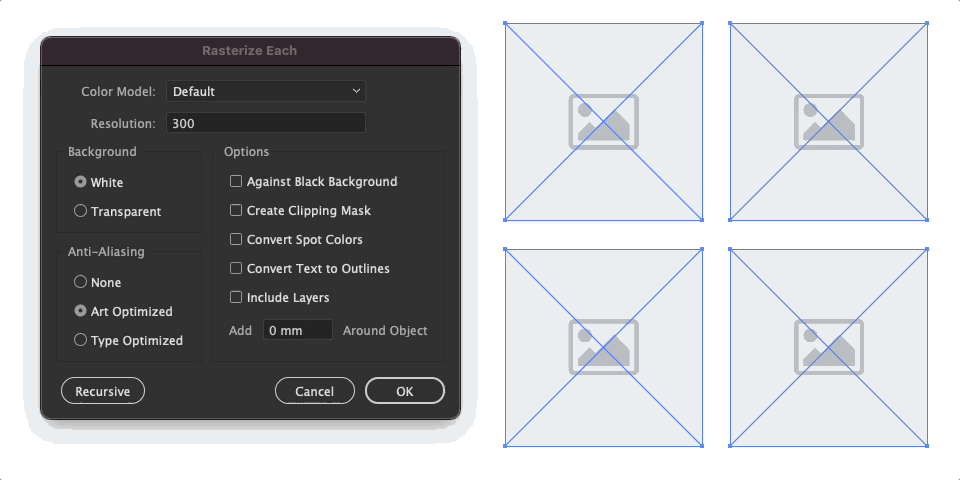
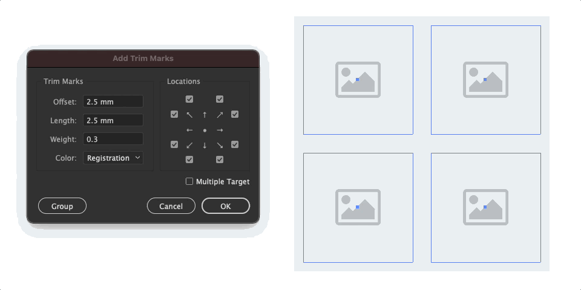
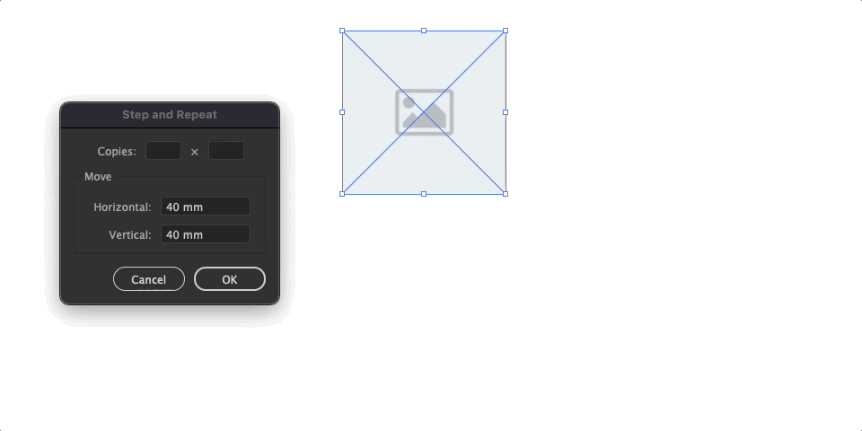
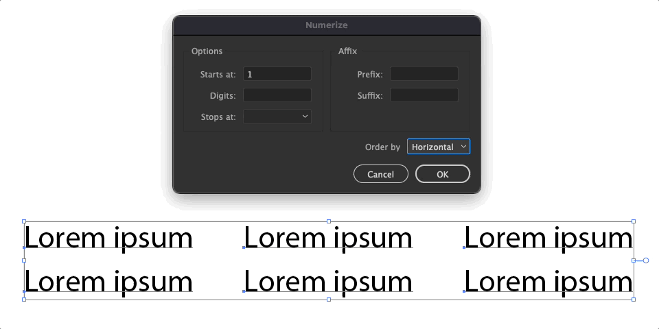
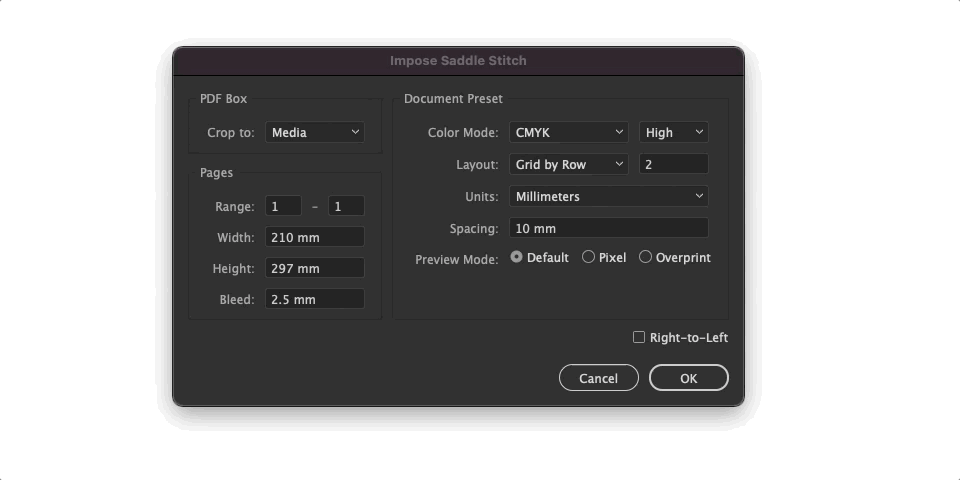

Illustrator Scripts
===================

General Purpose
---------------

### Resize/Reorder Artboards

Bulk resize all artboards.
Reorder artboards based on their title/position.

### Copy to Artboards

Duplicate selection to each artboards.

### Resize/Rasterize Each

`Context Menu > Transform > Transform Each...` can only modify size by scale while this script accepts target size.
`Menu > Object > Rasterize...` will group selected items and rasterize it once while this script rasterize each item.

Prepress
--------

### Add Trim Marks

A direct replacement to `Menu > Object > Create Trim Marks`, which works great but extremely limited in configuration. There is also multi-target support as seen below.

### Step and Repeat

User of CorelDRAW would be familiar with this feature.

### Relink Same/Multipage

Relink multiple items at once, which somehow is not natively supported. Use `Relink Same` to set the same image/PDF page to all targets, or `Relink Multipage` to iterate images/PDF pages.

### Numerize

Iterate through selected texts and retype them to index. There is also alphabet suffix support which can be useful for naming duplex impositions.

### Impose

Supports imposing `N-Up`, `Perfect Bound` and `Saddle Stitch`.

Known Issue
-----------

* EditText units validator is unstable, entering operator like `+` will crash the app.
* `Links/Relink *` - In document with large number of artboards scattered through multiple row positions, only first row of selection is detected.
* `Impose/*` - When artboards exceed canvas size, units will break causing oversized `PlacedItem`.