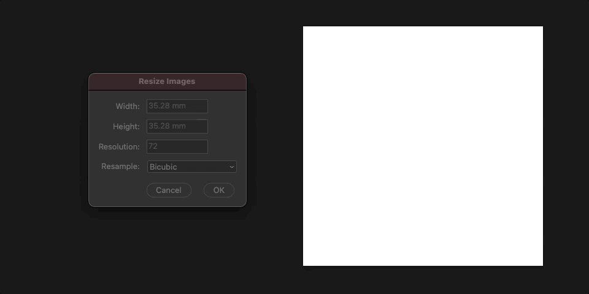

Photoshop Scripts
=================

General Purpose
---------------

### Resize Images/Canvases

Bulk resize all documents.

Prepress
--------

### Add Bleed

Create a layout guide around image and distribute bleed to all documents.

Known Issue
-----------

* EditText units validator is unstable, entering operator like `+` will crash the app.