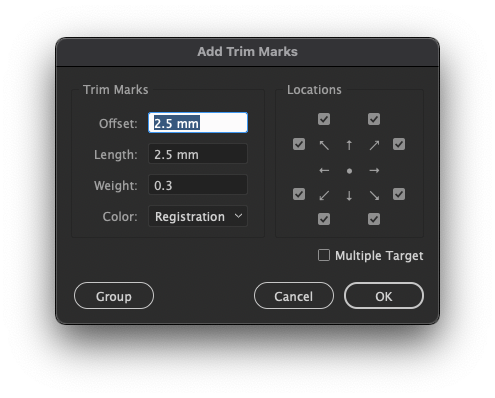
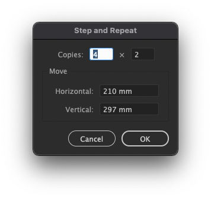
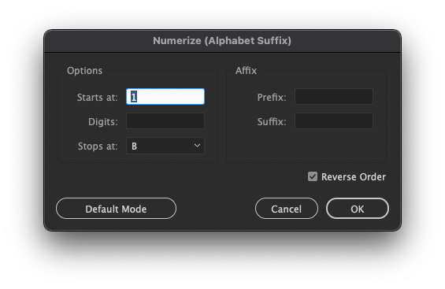
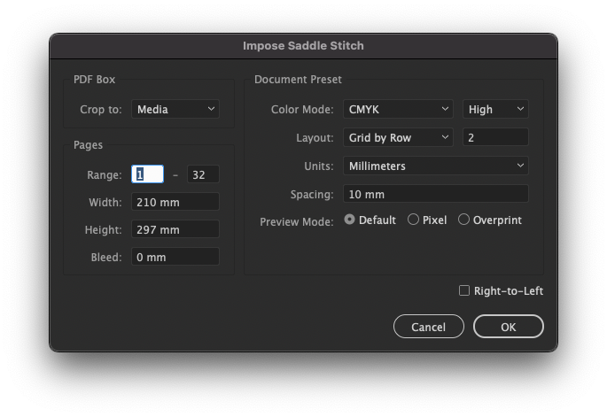
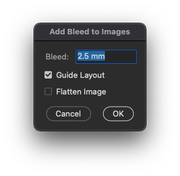

Prepress Adobe Scripts
======================

Essential Illustrator and Photoshop scripts for commercial printshop. While most of these scripts are general purpose, some are heavily prepress-focused like trim marks and imposition.

Illustrator Scripts
-------------------

Head over to [Illustrator Scripts](Illustrator%20Scripts) for explanation.

Photoshop Scripts
-----------------

Head over to [Photoshop Scripts](Photoshop%20Scripts) for explanation.

Install
-------

These scripts are **not standalone**, all of them require hidden directories to be in pre-determined location. This is why it is recommended to put them in Adobe installation paths, and access them from menu bar.

### Automatic Installation

Run `patch-scripts.bat` as admin (Windows) or `patch-scripts.sh` with sudo (macOS).

### Manual Installation

Find `Scripts` directory in your local Adobe installation paths:
* Illustrator - `$PATH_TO_APP/Presets/$LOCALE_CODE/Scripts`.
* Photoshop - `$PATH_TO_APP/Presets/Scripts`.

Copy all directories within corresponding sub-directory of this repository.
Note that some directories like `.lib` and `.res` are hidden in macOS, they must be included as well.

Resources
---------

ExtendScript & SUI:
* [**Official ExtendScript Wiki**](https://github.com/ExtendScript/wiki/wiki)
* [**Official JavaScript Tools Guide**](https://wwwimages2.adobe.com/content/dam/acom/en/devnet/scripting/pdfs/javascript_tools_guide.pdf)
* [ScriptUI for Dummies](https://adobeindd.com/view/publications/a0207571-ff5b-4bbf-a540-07079bd21d75/92ra/publication-web-resources/pdf/scriptui-2-16-j.pdf)
* [ScriptUI JavaScript Reference](http://jongware.mit.edu/scriptuihtml/Sui/index_1.html)

Illustrator:
* [**Official Scripting**](https://www.adobe.com/devnet/illustrator/scripting.html)
* [Scripting Guide](https://ai-scripting.docsforadobe.dev/)
* [CS6 JavaScript Reference](http://jongware.mit.edu/iljscs6html/iljscs6/inxx.html)

Photoshop:
* [**Official Scripting**](https://www.adobe.com/devnet/photoshop/scripting.html)
* [CS5 JavaScript Reference](http://jongware.mit.edu/pscs5js_html/psjscs5/inxx.html)
