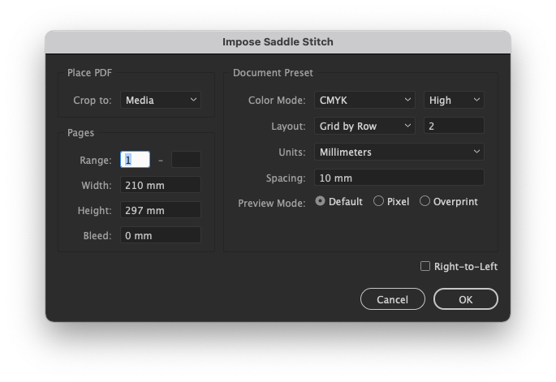
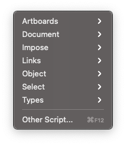
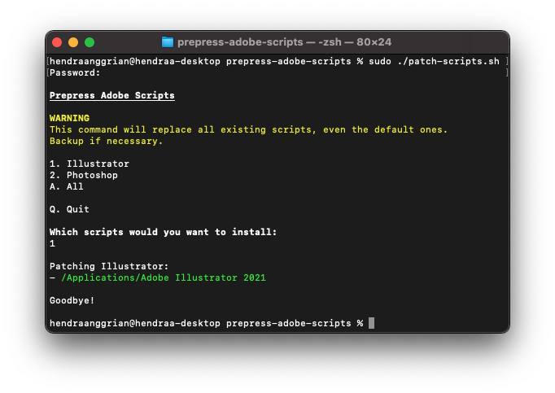

Prepress Adobe Scripts
======================

Adobe Illustrator and Photoshop scripts tailored for printing purposes.
* Highly customized standard library for consistent look and API across scripts.
* Tested only on latest Adobe suite.

Usage
-----

These scripts are **not standalone**, all of them requires hidden directories to be in pre-determined location. This is why it is recommended to put them in Adobe installation paths, and access them from menu bar.

### Automatic Installation
Run `patch-scripts.bat` as admin (Windows) or `patch-scripts.sh` with sudo (Mac).

### Manual Installation
Manually copy all files & folders within `Scripts` directory to `Presets` directory in local Adobe installation paths:
* Illustrator - `PATH_TO_ILLUSTRATOR/Presets/LOCALE_CODE/Scripts`.
* Photoshop - `PATH_TO_PHOTOSHOP/Presets/Scripts`.

Resources
---------

Official:
* [ExtendScript Wiki](https://github.com/ExtendScript/wiki/wiki)
* [JavaScript Tools Guide](https://wwwimages2.adobe.com/content/dam/acom/en/devnet/scripting/pdfs/javascript_tools_guide.pdf)

Unofficial:
* [ScriptUI for Dummies](https://adobeindd.com/view/publications/a0207571-ff5b-4bbf-a540-07079bd21d75/92ra/publication-web-resources/pdf/scriptui-2-16-j.pdf)
* [ScriptUI JavaScript Reference](http://jongware.mit.edu/scriptuihtml/Sui/index_1.html)
