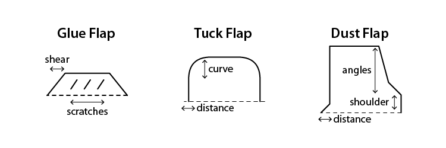

## Measure Dielines

Combine the length of all selected paths, excluding:
- Paths with any fill color, usually dielines are just simple lines.
- Paths with registration stroke color, registration color lines are reserved for trim marks.

## Add Flap Dieline

Flaps are common parts of product packaging dielines.

## Add Paperbag Dielines

Pretty self-explanatory.

