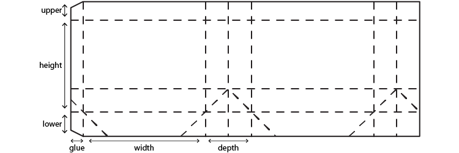

Measure Dielines (F8)
---------------------

Combine the length of all selected paths, excluding:
- Paths with any fill color, usually dielines are just simple lines.
- Paths with registration stroke color, registration color lines are reserved for trim marks.

Add Flap Dieline (⇧ F8)
-----------------------

Flaps are common parts of product packaging dielines.

Add Paperbag Dielines (⌘ F8)
----------------------------

Pretty self-explanatory.