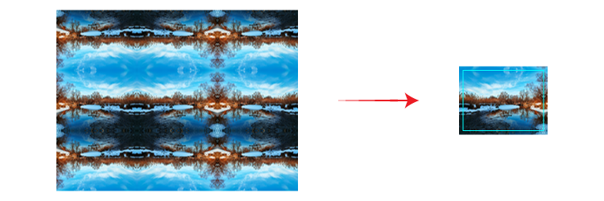

When adding bleed to link, it is advised to directly modify the source file:
- With vector file, use Illustrator's `Document Setup > Bleed`.
- With raster file, use Photoshop's `Resize Canvas` and fill the extra area
  with `Content-Aware`.

However, there are some cases where modifying source file is not an option
(likely due to huge complexity or sheer file size). We tend to apply brute force
method by duplicating items and flipping its content to mimic the appearance of
bleed. This script is designed to automate that particular task.

## Clip Objects

To complete the process, check `Clip Objects` control and specify its padding.

