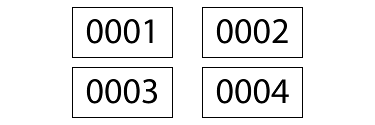

Change content of selected texts.

Retype (F6)
-----------

Retype the same content to all texts.

Texts with multiple fonts are not yet supported, as the rest of characters will use the first character's font.

Numerize (⇧ F6)
---------------

Iterate all texts and change the content to current index. There are `Digits` and `Stops at` configuration which are optional and can be left empty.

### Digits

Will append leading n-number of zeroes.

An example of this feature is voucher/invoice code.

### Stops at

Instead of iterating the index first, the script will take account of alphabet suffix. The index will only be iterated when current alphabet has reached destined character, at that point the alphabet will reset back to `A`.

An example of this feature is captioning a duplex printing layout.