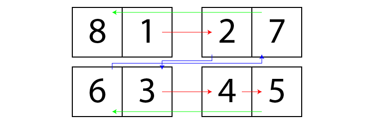

Imposition is one of the most repetitive tasks in digital prepression.
Due to its complexity, such feature usually requires a proprietary software or plugin.

Though not as sophisticated (like not having a preview),
this open-source script eliminates the need to use anything other than Illustrator itself.

## N-Up

Supporting 1, 2, 4, or 8 pages per artboard. N-Up imposition supports `Duplex Printing` and `Cut Stack` layout.

### Duplex Printing

When enabled, every odd-numbered page will be positioned at the back of the previous one and so on.
Such layout is necessary for printing both sides of the paper.

### Cut Stack

In a simple N-Up imposition (simplex or duplex), the final result are individual pages that need
to be stacked on top of each other in order to create a perfect bound booklet.
It's problematic if we are working on, for eaxmple, a magazine with large number of pages.

By enabling cut stack layout, the pages will flow on the next one.
So that the stacking process can be done with the whole layout as opposed to individual pages.

## Saddle Stitch

Saddle stitching is a very popular book binding process where papers are stapled together to the spine of the book.

### Right-to-Left

RTL writing systems and layout are widely used in Arabic, Hebrew, Persian and Urdu.
