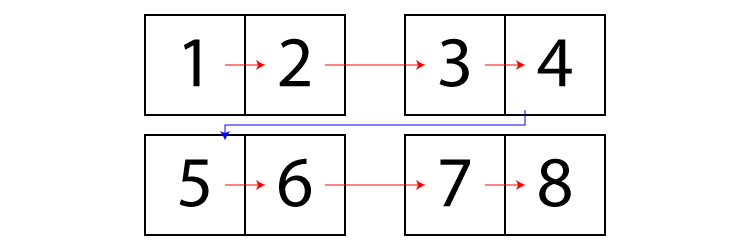
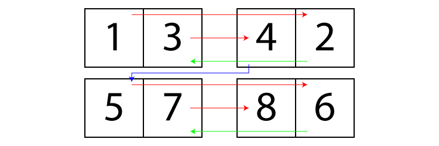
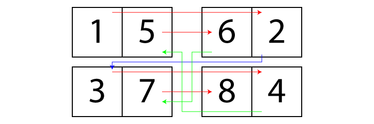
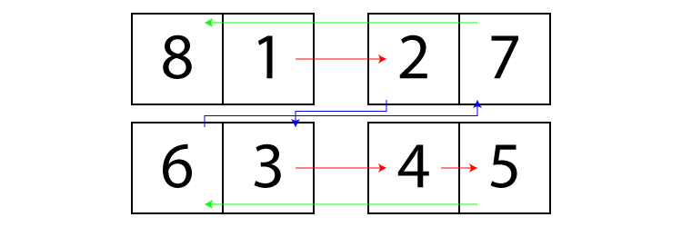

Imposition is one of the most complex yet repetitive task there is in digital
prepression. Due to its complexity, such feature usually requires a proprietary
software or plugin.

Though not as sophisticated (like not having a preview), this open-source script
eliminates the need to use anything other than Illustrator itself.

## N-Up

Supporting 1, 2, 4, or 8 pages per artboard. N-Up imposition
supports `Duplex Printing` and `Cut Stack` layout.

> Suitable for **Perfect Binding (Thermal/Adhesive Binding)**, **Spiral Binding
  (Coil Binding)**, **Wire Binding (Twin Loop)**, etc.

### Duplex Printing

When enabled, every odd-numbered page will be positioned at the back of the
previous one and so on. Such layout is necessary for printing both sides of the
paper.

### Cut Stack

In a simple N-Up imposition (simplex or duplex), the final result are individual
pages that need to be stacked on top of each other in order to create a perfect
bound booklet. It's problematic if we are working on, for example, a magazine
with large number of pages.

By enabling cut stack layout, the pages will flow on the next one. So that the
stacking process can be done with the whole layout as opposed to individual
pages.

## Saddle-Stitch

Due to its low cost, Saddle-Stitch is a very popular book binding process where
papers are stapled together to the spine of the book. The printed sheets should
contain 4 pages.

Unfortunately, Saddle-Stitch is not suitable for thick books since the width of
first and last sheet can differ greatly, which may alter arts located at the
edge of the pages.

> Suitable for **Saddle Stitching (Wire Stitching)** and **Loop Stitching**.

### Right-to-Left

RTL writing systems and layout are widely used in Arabic, Hebrew, Persian and
Urdu.

## Section-Sewn

The only choice left for a book with exceedingly large number of pages,
Section-Sewn is essentially a multiple Saddle-Stitch. Lined up sections are then
attached to the spine using glue or more sewing.

Because the pages are divided proportionally, the book will lay flat thus
preserving the content of the pages.

> Suitable for **Section Sewing (Smyth Sewing)** and **Case Binding (Hardcover)**.

#### References

- [OfficeMachines.net: Binding Types Explained](https://officemachines.net/binding/binding-types-explained.asp)
- [John Roberts: A Print Buyer's Guide to Binding Techniques](https://blog.johnroberts.com/print-buyers-guide-to-binding-techniques/)
