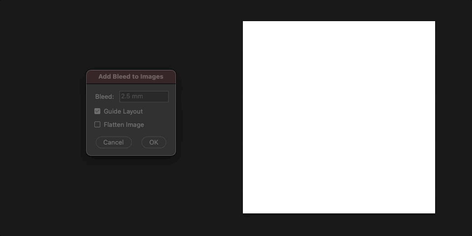
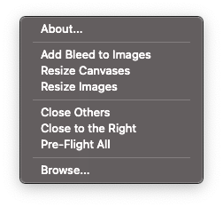

Prepress Adobe Scripts
======================

Essential Illustrator and Photoshop scripts for commercial printshop. While most of these scripts are general purpose, some are heavily prepress-focused like trim marks, dielines and imposition. Tested only on latest Adobe suite.

[Illustrator Scripts](illustrator_scripts.md)
---------------------

### Relink Same/Multipage

Relinking multiple items has always been a pain in the ass in Illustrator.

|   | Relink | *Relink Same* | *Relink Multipage* |
| - | :----: | :-----------: | :----------------: |
| Operation | One-by-one | At once | At once |
| Input file | Single PDF Single image | Single PDF Single image | Single PDF Multiple images Multiple PDFs & images
| Ordering | Layer index | &cross; | Layer index X/Y position

### Add Trim Marks

Though natively supported with `Menubar > Object > Create Trim Marks`, they are extremely limited in configuration.

|   | Create Trim Marks | *Add Trim Marks* |
| - | :---------------: | :--------------: |
| Trim marks around Clip Group | Content size | Clipping size |
| Trim marks around Path | Stroke | Fill |
| Customization | &cross; | &check; |
| Multiple targets | &cross; | &check; |

### Impose

Supports imposing `N-Up`, `Perfect Bound` and `Saddle Stitch`.

[Photoshop Scripts](photoshop_scripts.md)
-------------------

### Add Bleed

Create a layout guide around image and distribute bleed to all documents.

Install
-------

These scripts are **not standalone**, all of them require hidden directories to be in pre-determined locations. This is why it is recommended to put them in Adobe installation paths, and access them from menu bar.

### Automatic Installation

Run `install.bat` as admin (Windows) or `install.sh` with sudo (macOS).

### Manual Installation

Find **Scripts** directory in your local Adobe installation paths:
* Illustrator - `$PATH_TO_APP/Presets/$LOCALE_CODE/Scripts`.
* Photoshop - `$PATH_TO_APP/Presets/Scripts`.

Now copy two things:
* Content of `Illustrator/Photoshop Scripts` to **Scripts**.
* `.stdlib` to parent directory of **Scripts**.

> In macOS, make sure to show all hidden files in Finder.

Resources
---------

ExtendScript & SUI:
* [*Official ExtendScript Wiki*](https://github.com/ExtendScript/wiki/wiki)
* [*Official JavaScript Tools Guide*](https://wwwimages2.adobe.com/content/dam/acom/en/devnet/scripting/pdfs/javascript_tools_guide.pdf)
* [Scripting Guide](https://extendscript.docsforadobe.dev)
* [ScriptUI for Dummies](https://adobeindd.com/view/publications/a0207571-ff5b-4bbf-a540-07079bd21d75/92ra/publication-web-resources/pdf/scriptui-2-16-j.pdf)
* [ScriptUI JavaScript Reference](http://jongware.mit.edu/scriptuihtml/Sui/index_1.html)

Illustrator:
* [*Official Scripting*](https://www.adobe.com/devnet/illustrator/scripting.html)
* [Scripting Guide](https://ai-scripting.docsforadobe.dev)
* [CS6 JavaScript Reference](http://jongware.mit.edu/iljscs6html/iljscs6/inxx.html)

Photoshop:
* [*Official Scripting*](https://www.adobe.com/devnet/photoshop/scripting.html)
* [CS5 JavaScript Reference](http://jongware.mit.edu/pscs5js_html/psjscs5/inxx.html)
