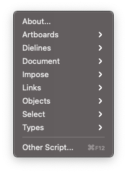
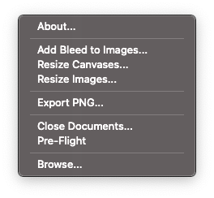

Prepress Adobe Scripts
======================

Collection of Illustrator and Photoshop scripts to automate repetitive tasks and procedures of preparing final print layout. Most of heavy-lifting workflow are expected to occur in Illustrator. Only tested on latest Adobe suite.

Head to [repository website](https://hendraanggrian.com/prepress-adobe-scripts) for description of the scripts.

Download
--------

There are several ways to use the scripts, a recommended method is to install them in Adobe installation paths so that they may appear in `Menubar > File > Scripts`.

In any case, download the source code and pick one of the following solutions.

### Automatic Installation

Run `install.bat` as admin (Windows) or `install.sh` with sudo (macOS).

### Manual Installation

Find **Scripts** directory in your local Adobe installation paths:
- Illustrator - `$PATH_TO_APP/Presets/$LOCALE_CODE/Scripts`.
- Photoshop - `$PATH_TO_APP/Presets/Scripts`.

Now copy these:
- Content of `Illustrator/Photoshop Scripts` to **Scripts**.
- `.stdlib` and `.stdres` to parent directory of **Scripts**.

> In macOS, make sure to show all hidden files in Finder.

### No Installation

It is possible to use the scripts by drag-and-dropping JSX files directly to Adobe apps.
Just make sure to keep the entirety of root folder instead of `Illustrator/Photoshop Scripts` folders.

This is because the scripts are **not standalone**, all of them require hidden directories to be in pre-determined locations.

Usage
-----

If you decide to install the scripts, they can be accessed from menubar or keyboard shortcuts.

### Keyboard Shortcuts

This is made possible by using Actions feature which binds Fn keys to menu item.
However, they need to be setup manually:
1. In Actions panel, select `Load Actions...`.
2. Navigate to local Adobe installation path, and find `Actions` directory under `Presets`.
3. Open a file named `Prepress Adobe Script`.
